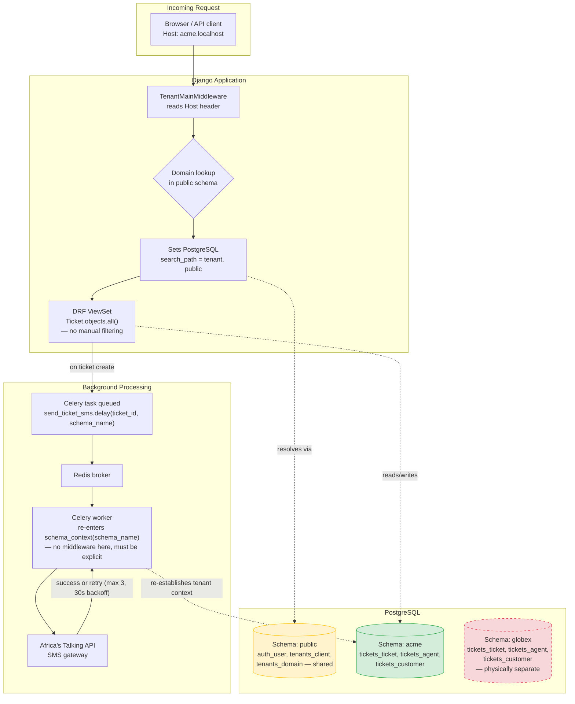

# DeskHive

A multi-tenant helpdesk / customer support SaaS built with Django, demonstrating
**schema-based tenant isolation** (not row-level filtering) using
[`django-tenants`](https://github.com/django-tenants/django-tenants), with
asynchronous, tenant-aware SMS notifications via Celery and Africa's Talking.

Built as a deliberate, from-scratch practical exploration of production-grade
multi-tenancy patterns — see [`docs/adr/`](docs/adr/) for the architectural
reasoning behind the key decisions.

---

## Why this project exists

Most tutorials teach multi-tenancy as "add a `tenant_id` column and filter
every query." That works, but the isolation guarantee lives entirely in
application-code discipline — one missed `.filter()` is a real data leak.

DeskHive instead uses **one PostgreSQL schema per tenant**, so isolation is
enforced by the database itself. Every architectural decision below exists to
answer one question honestly: *what actually happens when isolation is put
under real pressure* — real HTTP requests, real background workers, real
third-party API failures — not just in the ORM shell.

---

## System Architecture



**Key point the diagram is making**: the request path (top) gets tenant
context for free, from middleware. The async path (bottom) does not —
`schema_name` must be passed explicitly as a task argument and re-applied
inside the worker. This was the single most important lesson of the project;
see [ADR-0002](docs/adr/0002-async-sms-delivery-via-celery.md).

---

## Features

- **Schema-based multi-tenancy** — one Postgres schema per organization, via `django-tenants`
- **Subdomain tenant routing** — `acme.localhost`, `globex.localhost`, resolved automatically by middleware
- **DRF API** — ticket CRUD, isolation enforced by the database, zero manual tenant filtering in view code
- **Async SMS notifications** — Celery + Redis, tenant-aware background tasks, automatic retry with backoff on transient failures
- **Automated isolation proofs** — pytest suite proving isolation at both the ORM level and the HTTP layer (real requests, real `Host` headers)
- **Documented architecture decisions** — see [`docs/adr/`](docs/adr/)

---

## Tech Stack

| Layer | Choice |
|---|---|
| Framework | Django 6.0 |
| Multi-tenancy | django-tenants (schema-based) |
| API | Django REST Framework |
| Database | PostgreSQL |
| Async tasks | Celery + Redis |
| SMS | Africa's Talking (sandbox) |
| Testing | pytest, pytest-django |
| Package management | uv |
| Load Testing | k6 |

---

## Local Setup

```bash
git clone https://github.com/ansari-devhub/deskhive.git
cd deskhive

uv sync

cp .env.example .env
# fill in DB credentials, SECRET_KEY, AT_USERNAME, AT_API_KEY

python manage.py migrate_schemas --shared
python manage.py createsuperuser
```

Bootstrap the public tenant and a test tenant (see [`docs/adr/0001`](docs/adr/0001-schema-based-multi-tenancy.md) for why this step exists):

```python
python manage.py shell
>>> from apps.tenants.models import Client, Domain
>>> public = Client(schema_name='public', name='Public'); public.save()
>>> Domain.objects.create(domain='localhost', tenant=public, is_primary=True)
>>> acme = Client(schema_name='acme', name='Acme Corp'); acme.save()
>>> Domain.objects.create(domain='acme.localhost', tenant=acme, is_primary=True)
```

Run everything (three terminals):

```bash
python manage.py runserver
redis-server
celery -A config worker -l info --pool=solo   # --pool=solo required on Windows
```

Visit `http://acme.localhost:8000/api/tickets/`.

---

## Testing

```bash
uv run pytest -v
```

The test suite specifically includes **cross-tenant isolation proofs** — not
just CRUD tests. `test_isolation.py` proves isolation at the ORM level;
`test_api_isolation.py` proves it holds through a real HTTP request with a
tenant-specific `Host` header, exercising the actual middleware path.

---

## Failure Modes

Multi-tenant systems fail differently from single-tenant ones — a bug here
doesn't just break a feature, it can leak one customer's data to another.
Documented here deliberately, not as an afterthought.

### 1. Background workers losing tenant context
**Risk**: Celery workers run outside the request/response cycle and are
never touched by `TenantMainMiddleware`. A task that queries the database
without explicitly setting schema context will run against whatever schema
the connection last had active — potentially a different tenant's data.
**Mitigation**: every task that touches tenant-scoped data receives
`schema_name` as an explicit argument and wraps its logic in
`schema_context(schema_name)`. See [ADR-0002](docs/adr/0002-async-sms-delivery-via-celery.md).
**Status**: mitigated and tested, but relies on developer discipline for
every *future* task — not structurally enforced. A missed `schema_context`
call in a new task would silently reintroduce this risk.

### 2. Third-party API (SMS gateway) unavailability
**Risk**: Africa's Talking downtime, rate limiting, or transient network/SSL
errors (observed directly during development — see commit history) could
cause silent notification loss if unhandled.
**Mitigation**: async dispatch via Celery decouples ticket creation from SMS
delivery entirely; the task retries transient failures up to 3 times with
30s backoff and logs permanent failures rather than failing silently.
**Status**: mitigated. Not yet mitigated: no dead-letter queue or alerting
for tasks that exhaust all retries — a permanently failed SMS is currently
only visible in worker logs.

### 3. Migration drift across tenant schemas
**Risk**: `migrate_schemas` must run against every tenant schema
individually. At scale, a partial failure mid-run (e.g., the process is
killed after migrating 40 of 100 tenants) leaves schemas in an inconsistent
state — some ahead of others.
**Mitigation**: none implemented yet at this project's current scale.
**Status**: open risk, acceptable for current tenant count (single digits),
flagged for revisit before any production scaling — candidate for a future
ADR on migration strategy.

### 4. Shared-schema data visibility (by design, but easy to misunderstand)
**Risk**: `SHARED_APPS` tables (e.g. `auth_user`) are visible from *every*
tenant schema via PostgreSQL's `search_path` fallback — this was directly
observed and initially mistaken for a bug during development. A developer
unfamiliar with this could wrongly assume `SHARED_APPS` data is
tenant-isolated when it structurally is not.
**Mitigation**: documented explicitly here and in
[ADR-0001](docs/adr/0001-schema-based-multi-tenancy.md); only `TENANT_APPS`
models carry real isolation guarantees.
**Status**: understood and intentional, not a defect — but a real trap for
anyone extending this project without reading the ADRs first.

### 5. New tenant apps forgetting the `TENANT_APPS` vs `SHARED_APPS` split
**Risk**: adding a new Django app and forgetting to place it correctly in
`TENANT_APPS` (if it should be tenant-scoped) would either fail to isolate
data or fail to be visible where expected.
**Mitigation**: none automated. This is a manual, easy-to-miss step.
**Status**: open risk — a good candidate for a custom Django system check
in a future iteration.

### 6. Task broker (Redis) unavailability during ticket creation
**Risk**: `send_ticket_sms.delay(...)` requires a live connection to the
Celery broker (Redis) to enqueue the task. If Redis is down, `.delay()`
raises a connection error immediately. Left unhandled, this exception
propagates out of the view, and the client receives a `500` — even though
the `Ticket` itself was already successfully written to the database
moments earlier. A client retrying after a `500` risks creating a
duplicate ticket for an operation that, in fact, already succeeded.
**Mitigation**: `TicketViewSet.create()` wraps the `.delay()` call in its
own `try/except`, independent of ticket creation. A broker failure is
logged and surfaced to the client as a non-fatal `warning` field in an
otherwise successful `201 Created` response, rather than failing the
whole request or silently swallowing the problem.
**Status**: mitigated. Not yet mitigated: no automatic retry or
dead-letter mechanism if the broker is down at creation time — the SMS for
that specific ticket is simply never queued, with no later recovery path.

### 7. Django's development server cannot absorb concurrent connection bursts
**Risk**: observed directly via k6 load testing (20 concurrent virtual
users against `runserver`) — a burst of simultaneous initial connections
produced `connection actively refused` errors in the first few seconds of
the test, before the server stabilized and handled the remainder of the
run normally. This is not a defect in tenant isolation or authentication
logic: every failure was a connection-level rejection, not a wrong
response body, wrong-tenant data, or an auth bypass — isolation and JWT
auth held correctly for every request that was actually accepted.
**Mitigation**: none needed at the application level; this is expected,
documented behavior of `runserver`, which Django explicitly does not
consider production-ready or built for concurrency.
**Status**: not a defect, but a hard requirement for later phases —
production (and any serious load testing) must run behind a real
WSGI/ASGI server (e.g. gunicorn, uvicorn), never `runserver`. Load-test
results gathered against `runserver` should not be trusted as
representative of production capacity.

---

## Architectural Decision Records

| ADR | Decision |
|---|---|
| [0001](docs/adr/0001-schema-based-multi-tenancy.md) | Schema-based multi-tenancy over shared-schema row-level isolation |
| [0002](docs/adr/0002-async-sms-delivery-via-celery.md) | Asynchronous SMS delivery via Celery, not inline API calls |
| [0003](docs/adr/0003-customer-model-standalone-from-user.md) | `Customer` as a standalone model, not tied to Django's `User` |
| [0004](docs/adr/0004-shared-user-model-tenant-aware-jwt.md) | Shared `User` model with tenant-aware JWT authentication |
| [0005](docs/adr/0005-graceful-degradation-sms-dispatch-failure.md) | Graceful degradation when SMS task dispatch fails |

---

## Project Structure

```
deskhive/
├── apps/
│   ├── tenants/        # Client, Domain models — SHARED_APPS
│   └── tickets/        # Agent, Customer, Ticket — TENANT_APPS
│       ├── tasks.py     # Celery: tenant-aware SMS notifications
│       ├── test_isolation.py       # ORM-level isolation proof
│       └── test_api_isolation.py   # HTTP-level isolation proof
├── config/              # settings, celery.py, urls.py
├── docs/adr/            # architectural decision records
└── pyproject.toml
```

## Roadmap

This is Phase 2 of a staged multi-tenancy build (see project notes):
tenant-aware JWT auth and role-based permissions (Agent/Customer/Owner) are
next, followed by per-tenant billing limits and custom domain support.